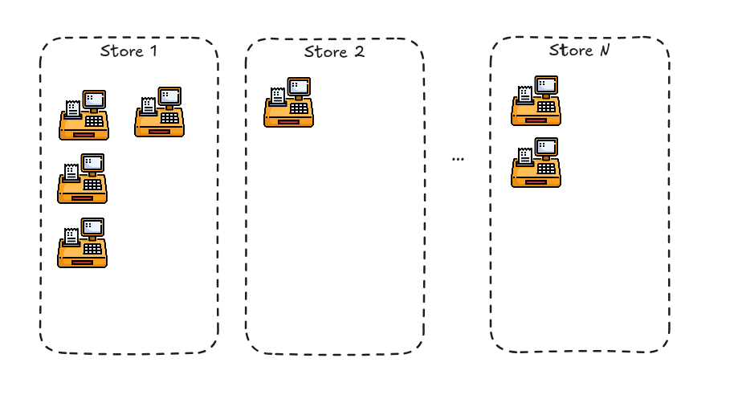
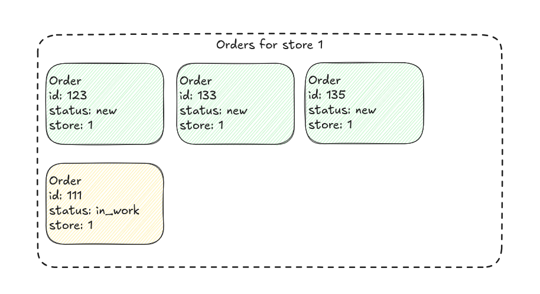

## 🛠️ Системный дизайн: доставка данных до кассовых устройств

### 📌 Контекст

В компании есть сеть из ~2000 магазинов. В каждом магазине установлено от 1 до 10 кассовых аппаратов. На кассах работает десктопное приложение, которое отображает список заказов, относящихся к текущему магазину. Это основной рабочий интерфейс кассира.

### 🖼️ Интерфейс кассы

На главном экране кассового приложения отображается список заказов, оформленных в конкретном магазине. Для каждого заказа отображается его текущий статус.

### 📡 Текущее обновление данных

На данный момент кассовое ПО напрямую взаимодействует с базой данных следующим образом:

1. **Обновление списка заказов** — каждые **20 секунд** касса запрашивает **полный список заказов** магазина.
2. **Обновление статусов заказов** — каждые **2 секунды** касса запрашивает **текущий статус каждого заказа**, отображаемого на экране.

Оба запроса реализованы через вызов хранимых процедур в базе данных. Кассы обращаются напрямую к базе.

### 📈 Профиль нагрузки

#### Общая нагрузка системы

- В день через систему проходит **~500 000 заказов**.
- Пик активности — в дневное время.

#### Нагрузка на базу данных заказов

- Список заказов обновляется **постоянно** – каждую секунду создаются новые заказы.
- Статусы заказов **часто меняются** (например, от "в обработке" до "готов к выдаче").
- Планируется увеличение нагрузки до **1 000 000 заказов в сутки**.
- Возможен рост количества магазинов **в 2 раза** (до 4000).

### ❗ Проблемы текущей реализации

- Прямая зависимость касс от базы данных создает **серьезную нагрузку** на БД.
- С ростом количества заказов и магазинов система **плохо масштабируется**.
- Отсутствует контроль над тем, как клиенты (кассы) потребляют данные.

### 🎯 Задача

Спроектировать новое решение, которое:

1. **Устраняет прямой доступ кассовых приложений к базе данных**.
2. Поддерживает горизонтальное масштабирование с учетом:
   - Увеличения объема заказов до **1 млн в сутки**.
   - Увеличения числа магазинов до **4000**.
3. Обеспечивает **оперативную доставку обновлений** (новые заказы и изменения статусов) на кассы с **низкой задержкой** (реалтайм или близко к нему).
4. Минимизирует нагрузку на хранилище заказов и обеспечивает отказоустойчивость.
5. Учитывает **ограничения десктопного ПО**, установленного на кассах (например, невозможность быстро менять приложение, отсутствие современных браузеров и т.д. — уточнить при необходимости).

### 💡 Дополнительные вопросы для обсуждения

- Какие технологии можно использовать для доставки обновлений на кассы (Polling, WebSocket, SSE, gRPC, MQTT и др.)?
- Как организовать кэширование и агрегацию данных?
- Где и как хранить актуальное состояние заказов?
- Как обеспечить безопасность и разграничение доступа к данным?
- Как построить мониторинг и логирование системы?

### 🔚 Ожидаемый результат

Опишите архитектуру системы с указанием:

- Основных компонентов и их взаимодействия.
- Механизма доставки данных на кассы.
- Подхода к масштабированию и отказоустойчивости.
- Потенциальных узких мест и способов их устранения.
- Планов по миграции с текущей архитектуры на новую.
